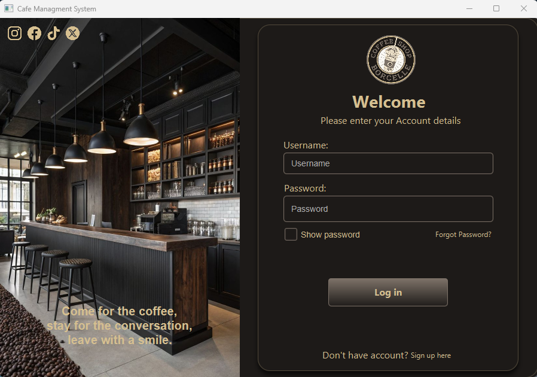
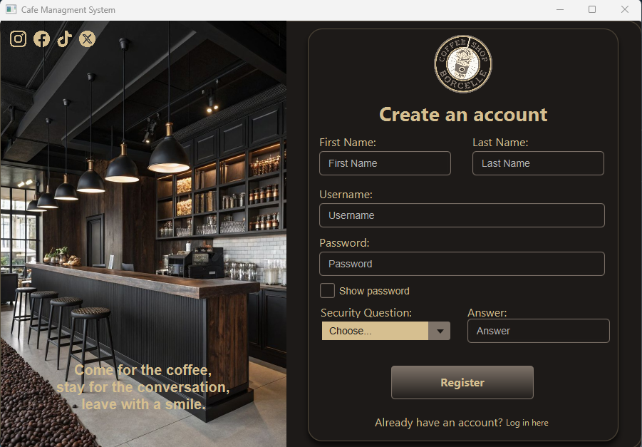
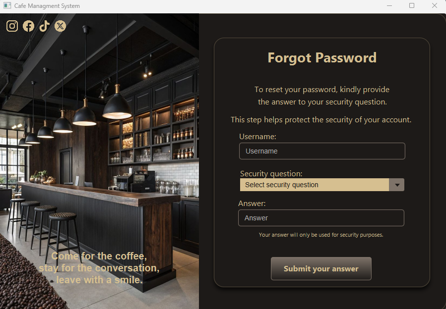
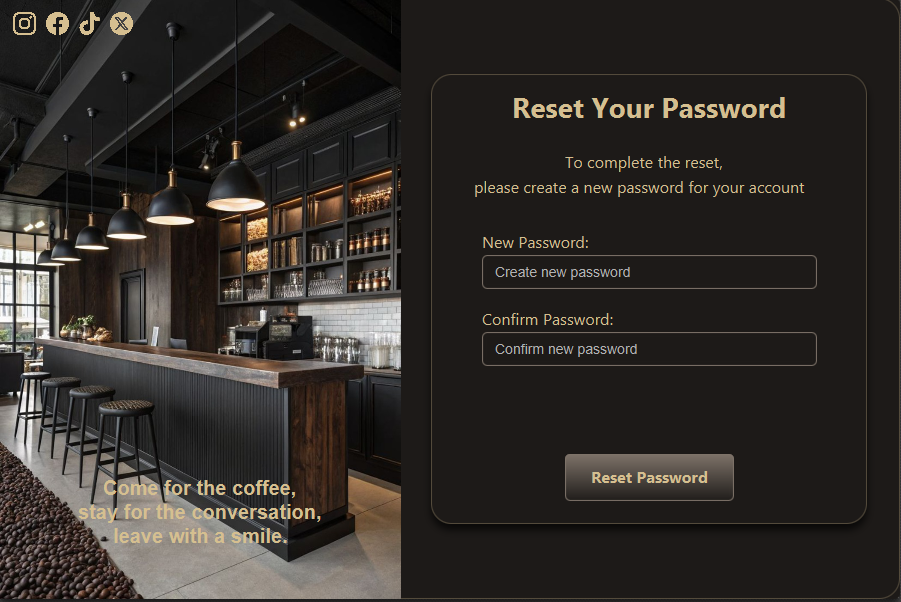
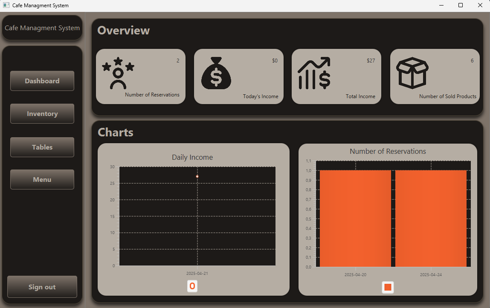
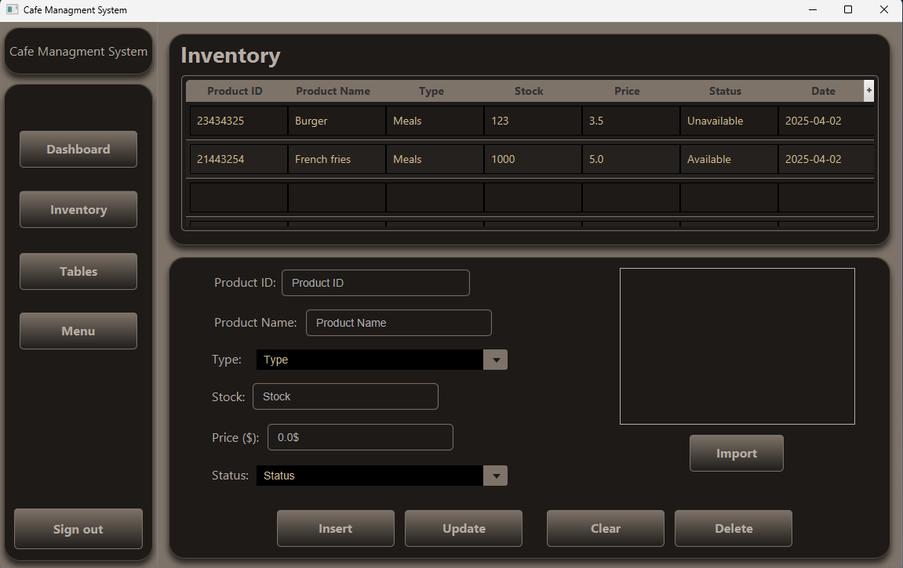
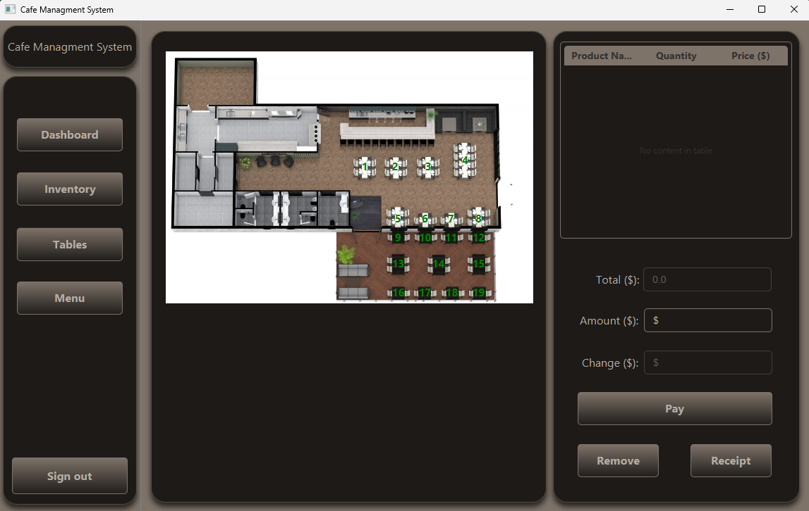

<h1 style="font-size: 36px; text-align: center; margin: 0;">Cafe Management System</h1>

A comprehensive Java-based Cafe Management System that helps cafes and restaurants efficiently handle tables, orders, and menu items. Built using **Java**, **JavaFX**, and **MySQL**, the app supports role-based access, real-time order tracking, and report generation.

---

## 📑 Table of Contents

- [Features](#features)
- [Screenshots](#screenshots)
- [Tech Stack](#tech-stack)
- [Usage](#usage)
- [Installation](#installation)
- [License](#license)
- [About Me](#about-me)

---

## Features

- 🍽️ Table and Order Management (Create, Update, Checkout)
- 🧾 Menu Item Selection with Quantity and Pricing
- 🔐 User Authentication & Role Management (Admin / Employee)
- 📊 Dashboard with Active Orders
- 💾 MySQL Database Integration
- ⚙️ Clean MVC Architecture

---

## Screenshots

### Registration

<p align="center">
  
  
  
  
</p>

### Software

<p align="center">
  
  
  
</p>

<h2 align="center">📸 All screenshots are available at: <a href="https://github.com/Al3k5a24/Cafe-Managment-System/tree/main/images">Images</a></h2>

---

## Tech Stack

- **Java 17+**
- **JavaFX**
- **MySQL**
- **SceneBuilder** (for building UIs)
- **JasperReports** (for printing and reporting)
- **Maven** (dependency management)

---

## Usage

- Login as **Admin** or **Employee**
- Manage tables, assign and track orders
- Select menu items and quantities
- Admin can manage users, menu, and view reports

---

## Installation

```bash
# Clone the repository
git clone https://github.com/YourUsername/cafe-management-system.git

# Navigate into the project directory
cd cafe-management-system

# Open the project in your preferred IDE (IntelliJ, Eclipse, etc.)

# Set up MySQL Database
# - Create a database (e.g. cafe_db)
# - Import provided SQL schema (if available)
# - Update DB credentials in application.properties or directly in code

# Build and run the application
mvn clean install

